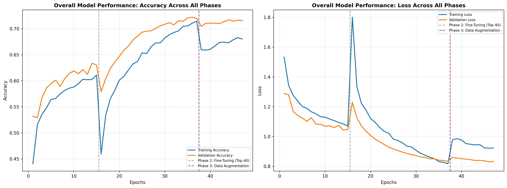
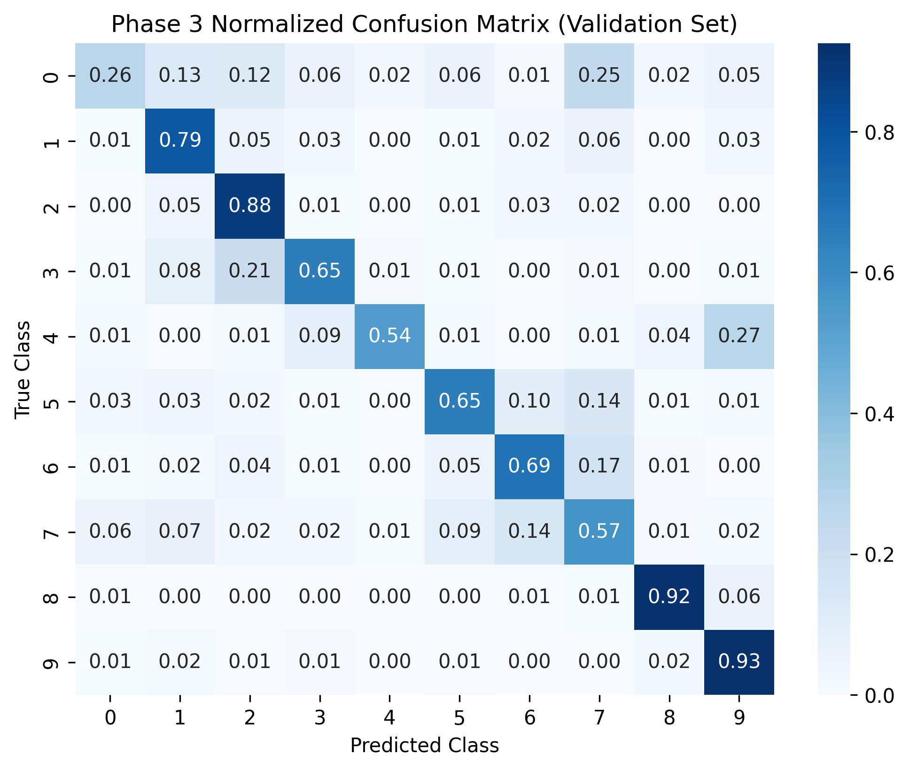

# Galaxy Morphology Classification with EfficientNetB0

Deep learning for classifying **galaxy morphology from astronomical imaging**, using the Galaxy10 DECaLS dataset and a transfer-learning pipeline built around EfficientNetB0.

The project combines **computational astrophysics, image classification, exploratory data analysis, transfer learning, fine-tuning, augmentation, and model error analysis** to investigate how well a convolutional neural network can distinguish different galaxy morphological structures.

---

## Project Overview

Galaxy morphology provides information about the visible structural properties of galaxies, including spiral structure, ellipticity, bars, mergers, and edge-on geometry.

This project uses the **Galaxy10 DECaLS** dataset to classify galaxy images into 10 morphological categories.

Rather than treating the task as a single train-and-evaluate experiment, the model was developed through several training stages:

1. Train a classification head on top of a frozen ImageNet-pretrained EfficientNetB0.
2. Fine-tune the upper layers of the EfficientNetB0 backbone.
3. Continue fine-tuning to improve convergence.
4. Introduce spatial augmentation, including rotations, flips, and zoom.
5. Evaluate performance using classification reports and normalized confusion matrices.
6. Investigate difficult morphological categories and model attention using Grad-CAM.

---

## Dataset

**Galaxy10 DECaLS** contains **17,736 RGB galaxy images**, each originally sized at **256 × 256 pixels**, with imaging in the `g`, `r`, and `z` bands. The images originate from the **DESI Legacy Imaging Surveys**, while the classification labels originate from **Galaxy Zoo**.

Dataset source:

[Galaxy10 DECaLS — astroNN documentation](https://astronn.readthedocs.io/en/latest/galaxy10.html?utm_source=chatgpt.com)

### Classes

| Class | Morphology            | Images |
| ----: | --------------------- | -----: |
|     0 | Distorted Galaxy      |  1,081 |
|     1 | Merging Galaxies      |  1,853 |
|     2 | Round Elliptical      |  2,645 |
|     3 | In-between Elliptical |  2,027 |
|     4 | Cigar Elliptical      |    334 |
|     5 | Barred Spiral         |  2,043 |
|     6 | Unbarred Tight Spiral |  1,829 |
|     7 | Unbarred Loose Spiral |  2,628 |
|     8 | Edge-on (No Bulge)    |  1,423 |
|     9 | Edge-on (With Bulge)  |  1,873 |

The class definitions and underlying dataset are based on Galaxy10 DECaLS; the project uses the class naming convention defined in the notebook. The original dataset documentation describes closely corresponding categories such as disturbed, round smooth, and edge-on galaxies.

---

## Exploratory Data Analysis

The dataset was inspected before model training to understand:

* Image dimensions and data types
* Class distribution
* Relative class proportions
* Representative examples from each morphology
* Potential class imbalance

The distribution is not uniform. **Cigar Elliptical** is particularly underrepresented with only 334 images, while Round Elliptical and Unbarred Loose Spiral each contain more than 2,600 images.

This imbalance is important when interpreting overall accuracy and per-class performance.

---

## Data Preparation

The dataset was split using a **stratified 80/20 split**:

* **Training:** 14,188 images
* **Validation:** 3,548 images
* `random_state = 42`

Images were resized from:

```text
256 × 256 × 3
        ↓
224 × 224 × 3
```

The TensorFlow data pipeline uses:

* Batch size: `32`
* Shuffling for training
* Prefetching with `AUTOTUNE`
* Repeated training dataset
* Stratified train/validation split

---

## Model Architecture

The classifier uses **EfficientNetB0 pretrained on ImageNet** as the convolutional backbone.

### Classification head

```text
EfficientNetB0
     │
     │ ImageNet pretrained features
     ▼
Global Average Pooling
     │
     ▼
Dense(256, ReLU)
     │
     ▼
Dropout(0.4)
     │
     ▼
Dense(10, Softmax)
```

Initial training used a frozen EfficientNetB0 backbone. The classification head contained approximately **330K trainable parameters**, while the full model contained approximately **4.38M parameters**.

---

# Training Strategy

The model was developed in three main phases.

## Phase 1 — Frozen Backbone

The EfficientNetB0 feature extractor was initially frozen and only the classification head was trained.

**Configuration**

* Optimizer: Adam
* Learning rate: `1e-3`
* Loss: Sparse categorical cross-entropy
* Batch size: `32`
* Early stopping
* Learning-rate reduction on plateau
* Model checkpointing

### Result

**Validation accuracy: 63.36%**

Validation loss:

```text
1.0428
```

---

## Phase 2 — Fine-Tuning

The upper portion of the EfficientNetB0 backbone was unfrozen to allow the pretrained visual features to adapt to galaxy morphology.

The learning rate was reduced to:

```text
1e-5
```

### Phase 2 — Run 1

Validation accuracy:

**69.59%**

Validation loss:

```text
0.8953
```

### Phase 2 — Run 2

Training was continued from the previous stage.

Validation accuracy:

**71.98%**

Validation loss:

```text
0.8346
```

This was the **highest validation accuracy reached during the training experiments**.

---

## Phase 3 — Spatial Augmentation

The fine-tuned model was further trained using spatial augmentation designed to expose the model to different orientations and scales.

Augmentation included:

* Horizontal and vertical flips
* Random rotation
* Random zoom of ±10%

The rotation factor was set to provide full 360° rotational variation.

The learning rate was reduced further to:

```text
5e-6
```

### Result

Validation accuracy:

**71.65%**

Validation loss:

```text
0.8308
```

The best checkpoint from this phase was restored.

---

## Training Progress

The complete training history across the different phases is shown below.



The master plot tracks both **accuracy and loss across the complete training process**, with the transitions between frozen-backbone training, fine-tuning, and augmentation marked explicitly.

---

# Final Evaluation

The Phase 3 model was evaluated on the held-out validation set of **3,548 images**.

|                     Class | Precision | Recall |   F1-score |
| ------------------------: | --------: | -----: | ---------: |
|             0 — Distorted |    0.4914 | 0.2639 |     0.3434 |
|               1 — Merging |    0.6621 | 0.7871 |     0.7192 |
|      2 — Round Elliptical |    0.7381 | 0.8790 |     0.8024 |
| 3 — In-between Elliptical |    0.8173 | 0.6519 |     0.7253 |
|      4 — Cigar Elliptical |    0.7059 | 0.5373 |     0.6102 |
|         5 — Barred Spiral |    0.7417 | 0.6528 |     0.6944 |
| 6 — Unbarred Tight Spiral |    0.6364 | 0.6885 |     0.6614 |
| 7 — Unbarred Loose Spiral |    0.5830 | 0.5741 |     0.5785 |
|    8 — Edge-on (No Bulge) |    0.8966 | 0.9155 | **0.9059** |
|  9 — Edge-on (With Bulge) |    0.8203 | 0.9253 | **0.8697** |

### Overall

```text
Validation Accuracy : 71.65%
Macro F1            : 0.6910
Weighted F1         : 0.7085
Validation Samples  : 3,548
```

---

## Confusion Matrix

The normalized confusion matrix helps reveal where the model succeeds and where morphological categories overlap.



---

# Model Diagnostics

Overall accuracy does not tell the complete story for this problem.

### Strong performance on edge-on galaxies

The model performed particularly well on the two edge-on categories:

* **Edge-on (No Bulge): F1 = 0.9059**
* **Edge-on (With Bulge): F1 = 0.8697**

Their strong performance is consistent with the visually distinctive linear structure of edge-on galaxy profiles.

### Distorted vs. Merging Galaxies

The model had considerably more difficulty with the distorted category.

The primary source of ambiguity was the overlap between:

* **Distorted Galaxies**
* **Merging Galaxies**

Both can contain irregular, low-density and disturbed structures, making the boundary between the categories visually difficult to learn.

### Fine-grained elliptical morphology

The elliptical categories also present a more subtle classification problem.

In particular:

* Round Elliptical
* In-between Elliptical
* Cigar Elliptical

represent morphological variation along a visual continuum rather than completely separated visual patterns.

This makes them more challenging than categories with strong structural signatures.

---

# Interpretability

To go beyond classification accuracy, Grad-CAM was used to examine regions of an image contributing to the model's prediction.

The Grad-CAM analysis extracts activation information from the final convolutional layer of EfficientNetB0 and produces an attention heatmap.

This provides a way to inspect whether the model is responding to meaningful structural regions of galaxies rather than treating the prediction as a completely opaque output.

The notebook also includes inspection of prediction probabilities for ambiguous examples, allowing model confidence to be examined instead of relying only on the final predicted class.

---

# Key Findings

### 1. Transfer learning provided a strong starting point

The frozen EfficientNetB0 model reached:

**63.36% validation accuracy**

Fine-tuning the backbone increased this to:

**71.98%**

---

### 2. Fine-tuning produced the largest improvement

The progression was:

```text
Phase 1                  63.36%
        ↓
Phase 2 Run 1            69.59%
        ↓
Phase 2 Run 2            71.98%
        ↓
Phase 3 Augmentation     71.65%
```

The highest validation accuracy was reached during Phase 2 Run 2.

The augmentation phase did not improve the peak validation accuracy further, although it produced a comparable validation loss and provided an additional experiment into rotational and spatial invariance.

---

### 3. Morphological distinctiveness matters

Categories with strong structural signatures, particularly edge-on galaxies, were easier for the model to distinguish.

More continuous or visually overlapping morphological categories produced substantially more classification ambiguity.

---

### 4. Accuracy alone hides class-level behavior

The difference between the **90.59% F1-score for Edge-on (No Bulge)** and **34.34% for Distorted Galaxy** demonstrates why per-class metrics and confusion matrices are important for this problem.

---

# Project Structure

```text
Galaxy-morphology/
│
├── data/
│   └── Galaxy10_DECals.h5
│
├── model/
│   ├── galaxy10_efficientnetb0_phase1.keras
│   ├── galaxy10_efficientnetb0_phase2_run1.keras
│   ├── galaxy10_efficientnetb0_phase2_run2.keras
│   └── galaxy10_efficientnetb0_phase3_augmented.keras
│
├── visuals/
│   ├── master_training_performance.png
│   ├── phase2_run1_performance.png
│   ├── phase2_run2_performance.png
│   ├── cm_phase1.png
│   ├── cm_phase2_run1.png
│   ├── cm_phase2_run2.png
│   └── cm_phase3.png
│
├── Galaxy_Morphology.ipynb
└── README.md
```

> The dataset file is large and may be excluded from version control depending on the repository configuration.

---

# Tech Stack

**Programming**

* Python
* NumPy
* Pandas

**Deep Learning**

* TensorFlow
* Keras
* EfficientNetB0
* Transfer Learning
* Fine-Tuning

**Machine Learning / Evaluation**

* Scikit-learn
* Classification reports
* Confusion matrices

**Visualization**

* Matplotlib
* Seaborn
* Grad-CAM

**Environment**

* Google Colab
* Google Drive

---

# Reproducibility

The project was developed in Google Colab using the Galaxy10 DECaLS HDF5 dataset.

The main notebook contains the complete workflow:

```text
Dataset loading
      ↓
Exploratory analysis
      ↓
Stratified train/validation split
      ↓
TensorFlow data pipeline
      ↓
EfficientNetB0 transfer learning
      ↓
Fine-tuning
      ↓
Spatial augmentation
      ↓
Model evaluation
      ↓
Error analysis
      ↓
Grad-CAM interpretation
```

The pretrained model checkpoints generated during the experiments are stored separately in the `model/` directory.

---

# Limitations

Several factors limit how the current results should be interpreted:

* The dataset contains noticeable class imbalance.
* Some morphological categories are inherently difficult to distinguish visually.
* The validation set comes from the same dataset distribution as the training data rather than representing an independent astronomical survey.
* A validation accuracy of ~72% does not imply that all galaxy morphologies are classified equally well.
* The weakest-performing categories demonstrate that overall accuracy can conceal substantial class-level differences.

Therefore, the results are best interpreted as an investigation of **deep-learning-based morphology classification on Galaxy10 DECaLS**, rather than as a general-purpose galaxy morphology classifier.

---

# Future Work

Potential extensions include:

* Addressing class imbalance using class weighting or targeted sampling.
* Investigating architectures designed specifically for rotationally structured astronomical images.
* Comparing EfficientNetB0 with other CNN architectures.
* Exploring more systematic uncertainty and calibration analysis.
* Performing more extensive error analysis on visually ambiguous galaxies.
* Evaluating the model on images from a different astronomical survey to investigate cross-survey generalization.
* Exploring explainability methods beyond Grad-CAM.
* Investigating whether learned representations can support downstream astrophysical analysis beyond morphology classification.

---

# Conclusion

This project explores the application of **deep learning to a real astronomical imaging problem**, moving beyond a simple image-classification benchmark.

The experiments demonstrate that an ImageNet-pretrained EfficientNetB0 can learn useful morphological representations from Galaxy10 DECaLS images, with validation accuracy improving from **63.36% with a frozen backbone to 71.98% after fine-tuning**.

More importantly, the analysis shows that model performance depends strongly on the morphological structure being classified: visually distinctive edge-on galaxies are classified substantially more reliably than ambiguous distorted and fine-grained elliptical categories.

The project therefore combines **astronomical data analysis, machine learning experimentation, and scientific interpretation** to investigate both what the model can learn and where its limitations arise.

---

## Dataset & Attribution

Galaxy10 DECaLS dataset documentation:

[astroNN — Galaxy10 DECaLS](https://astronn.readthedocs.io/en/latest/galaxy10.html?utm_source=chatgpt.com)

The dataset documentation attributes the images to the **DESI Legacy Imaging Surveys** and the classification labels to **Galaxy Zoo**.
